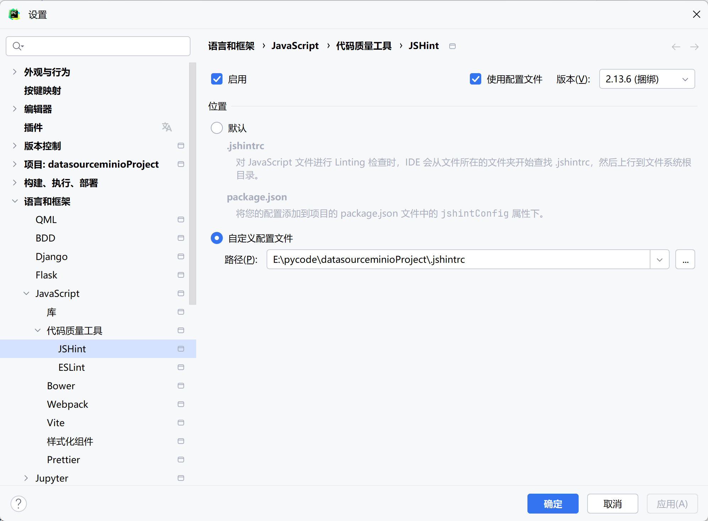

1、minio启动
minio.exe server minio_data --console-address "127.0.0.1:9001"
minio账号:admin 密码:password

2、conda环境无法激活问题
目录：E:\anaconda\etc\conda\activate.d
在上述 activate.d 目录中，新建一个文件 nodejs_path.ps1，内容改成正确的 E:\nodejs\ 即可。例如：
# nodejs_path.ps1
# 当激活 Conda 环境时，把全局 Node.js 安装路径 (E:\nodejs\) 插到 PATH 前面
$nodeGlobal = "E:\nodejs\"

# 如果 PATH 里还没以 $nodeGlobal 开头，就插入
if (-not ($env:Path.StartsWith($nodeGlobal))) {
    $env:Path = $nodeGlobal + ";" + $env:Path
}

3、按照以下步骤，就能确保 JSHint 在你的前端工程里正确识别 ES6 模块（import/export）和箭头函数，逗号分隔也不会再报错。
小结
* 工作目录：永远操作在 E:\pycode\datasourceProject\frontend。

* 安装 JSHint：npm install --save-dev jshint（会生成 node_modules/.bin/jshint）。

* 配置文件：在同级 datasourceProject/frontend/ 下创建 .jshintrc，填入

    json
    复制代码
    {
      "esversion": 6,
      "module": true,
      "browser": true
    }
运行检查：使用 npx jshint src/utils/http.js 或 npx jshint "src/**/*.js"。

4、js文件中import等报错，
  ✅ 方法二：在 PyCharm 配置中启用 JSHint 并使用配置文件
  
  打开 File > Settings（或 Ctrl + Alt + S）。
  
  导航到 Languages & Frameworks > JavaScript > Code Quality Tools > JSHint。
  
  勾选 “Enable”。
  
  在 “Configuration file” 中指定你项目中的 .jshintrc 文件路径。
  
  点击 “Apply” 然后 “OK”。
  